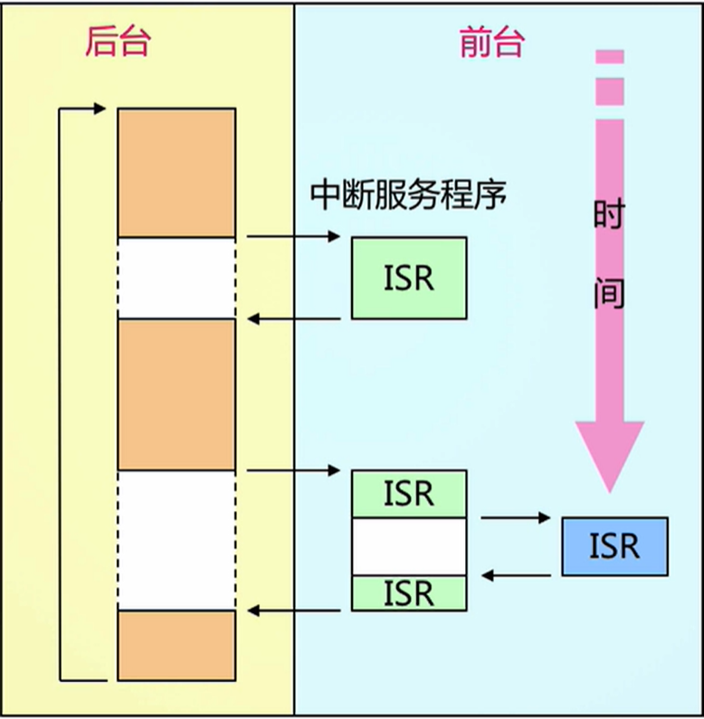

# 前后台代码结构

## 概述

+ 最常见、简单的单一顺序执行代码结构，通常也称之为**裸机程序**。

+ 前台：在中断服务程序中处理异步事件，时间相关性很强的关键操作一定是靠中断服务程序来保证的。

```C
void ISR1(void)
{
    flag1 = 1;
    doSomething1();
}

void ISR2(void)
{
    flag2 = 1;
    doSomething2();
}
```

+ 后台：在主循环中调用相应的处理函数来完成相应的操作。这种系统在处理的及时性上比实际可以做到的略差。

```C
int flag1;
int flag2;

int main()
｛
   for(;;)
   {
       if(flag1 == 1)
       {
           doSomethingForISR1();
       }
      if(flag2 == 1)
      {
          doSomethingForISR2();
      }
   }

	return 0;
｝    
```

前后台示意图如下图所示;



## 存在的问题

+ 缺点1：实时性不能保证；

如在前台中同时设置flag1，flag2标志位，在main函数中需要等待doSomethingForISR1()或doSomethingForISR2()完成后才能执行另一个函数；如果该设备对响应函数有较为严格的时间限制，则前后台结构不能实现该要求。

所以如何保证优先级更高的事件（如紧急性的）立即得到处理？

+ 缺点2：存在CPU空转的情况，CPU利用率不高，白白浪费功耗；

```c
void doSomethingForISR1()
{
    /* 运行过程中可能需要等待一些资源才可以继续执行 */
    while(!resouceReady)
    {
        /* 为了避免程序卡死，等待一段时间超时退出 */
        /* 等待的过程中CPU一直卡在此处，执行无用操作 */
        if(++delay >= TIME_1S)
            return -1;
    }
}
```

+ 缺点3：强迫人按照机器的顺序工作方式思考编码。当执行的任务越多，代码结构越复杂，编码难度越大。


+ 缺点的根本原因：只有一颗CPU按照顺序方式编码；每个项目都需要重新划分任务以及管理和控制任务的运行和相互关系。

## 解决方案

+ RTOS