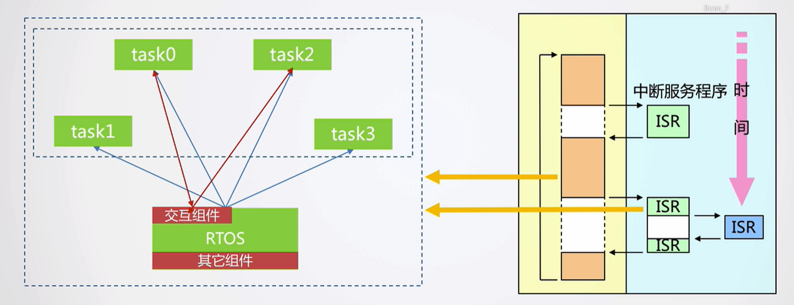
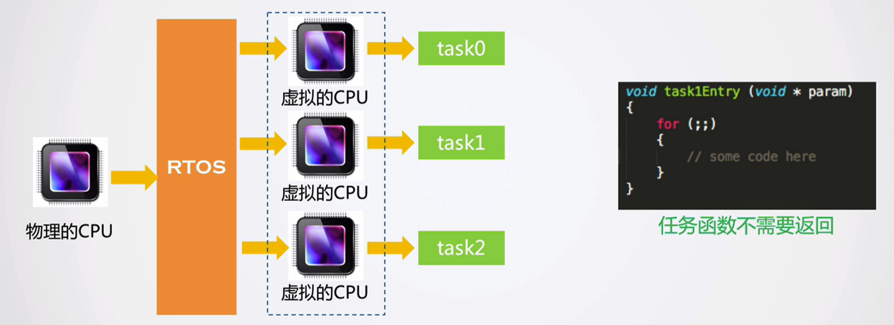
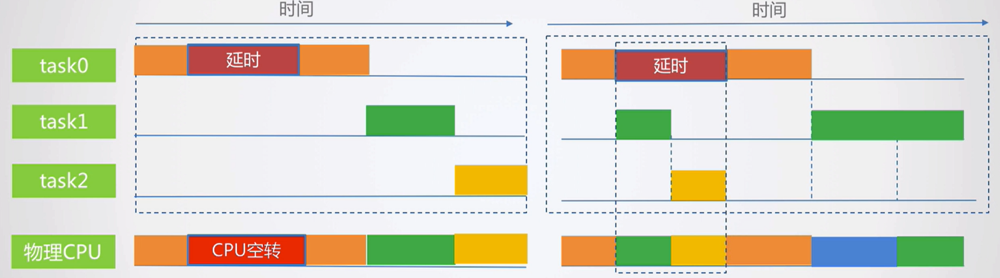
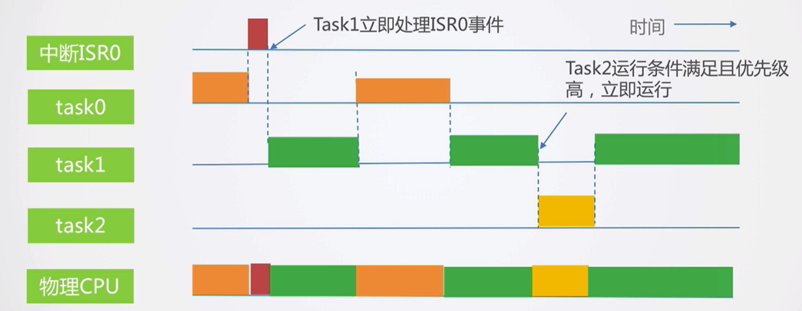
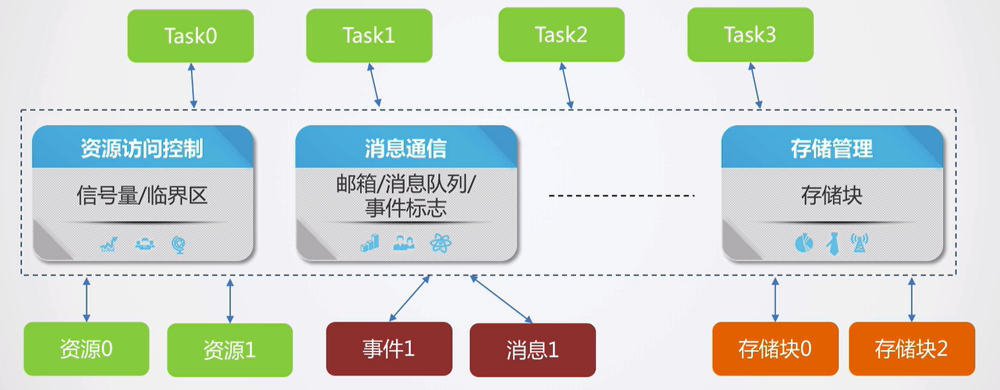

# RTOS原理及功能简介

## 概述

+ 基本概念

> 实时操作系统（RTOS）是指当外界事件或数据产生时，能够接受并以足够快的速度予以处理，其处理的结果又能在规定的时间之内来控制生产过程或对处理系统做出快速响应，调度一切可利用的资源完成实时任务，并控制所有实时任务协调一致运行的操作系统。提供及时响应和高可靠性是其主要特点。

+ 特点：

1. 实时性：在规定的时间内对事件进行响应；实时并不意味着快；
2. 操作系统：一种系统软件；提供任务管理和协调的控制功能；
3. 嵌入式：运行于特定的嵌入式硬件；功能可裁剪、代码可移植；

+ 小结：

RTOS是一种通用的任务管理框架，用于控制任务的运行和任务之间的交互，保证事件得到实时处理。

## 工作原理简介

### 特点1：提供多个执行流

虽然实际只有一颗CPU硬件，但是通过**“虚拟化”**，每个Task好像独占CPU。

任务函数无需返回，将极大的简化任务代码的编写。

编码时按照接收人的思维方式进行代码编写。

其中，“虚拟”的CPU并非完全的虚拟，“独占”也并不是真正的独占，而只是任务认为自己独占。

### 特点2：实时性

通过RTOS控制任务的运行时机，事件处理的实时性得到有效保证。

### 特点3：提供组件

提供了一些组件用于简化任务对资源的访问，时间的处理，以及任务之间的通信，有效降低任务之间的代码耦合。

## 总结

### 1.通用的任务框架管理

针对缺点：强迫人按照机器的顺序工作方式思考编码。

改进：开发不同项目时可重复利用，简化了开发的难度，更加接近与人处理问题的思考方式；

### 2.更高效的利用CPU资源

针对缺点：CPU利用率不高；

改进：通过将CPU控制权切换给其他任务，避免了空转造成的浪费，同时也降低了功耗；

### 3.更好的事件实时处理机制

针对缺点：实时性不能保证

改进：当事件发生时，或者有更高优先级的任务需要运行时，均能快速切换过去，做更重要或者更紧急的事情；