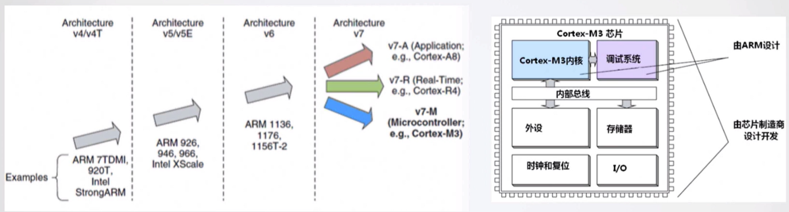
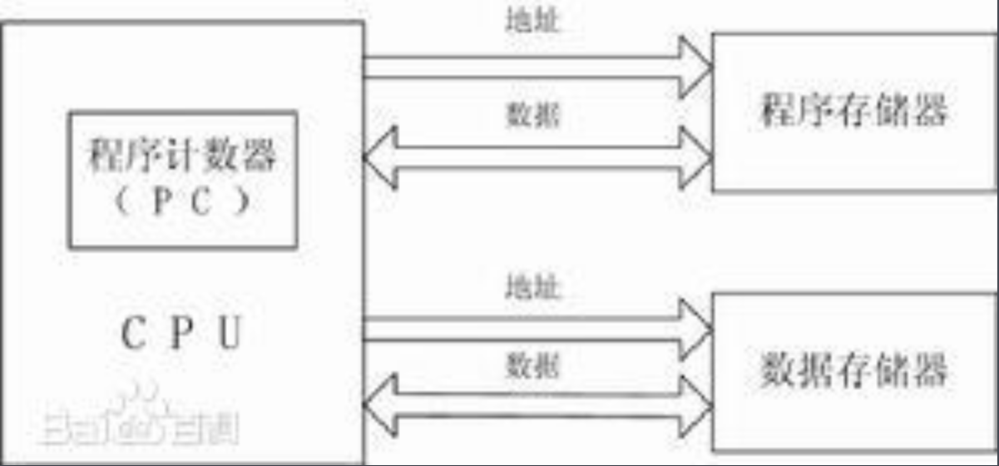
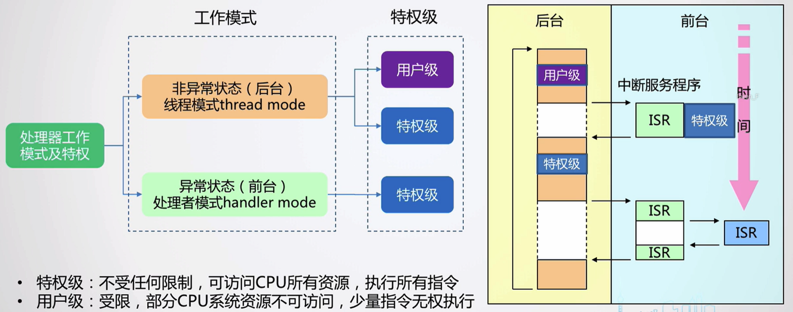
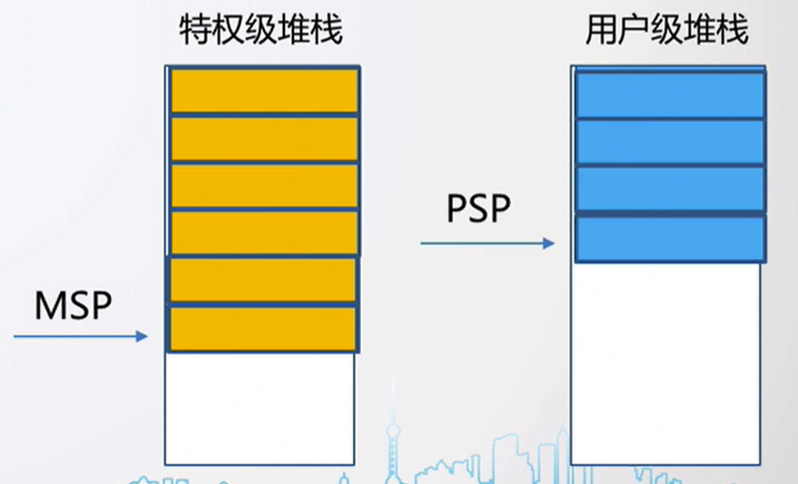
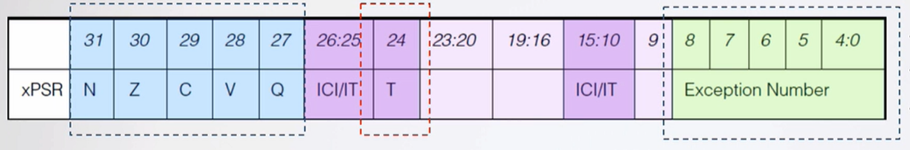
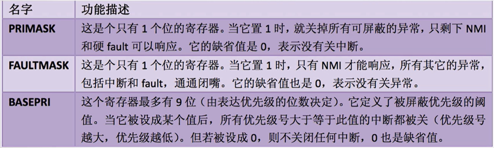
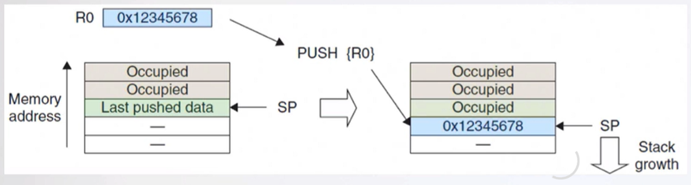
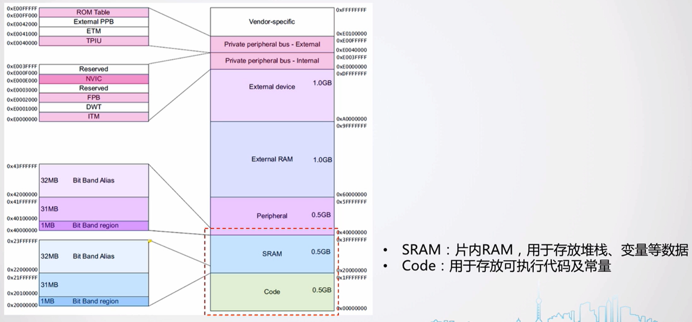

# 芯片内核简介

## 内核概述

Cortex-M3\M4是ARM公司开发的CPU内核。

完整的MCU芯片集成了Cortex-M3\M4内核及其他组件。

特性：

+ 32位RISC处理器；
+ 哈弗结构；
+ 3级流水线；
+ 内嵌中断向量控制器和Systick定时器；

> 注：哈弗结构
>
> （百度百科）哈佛结构是一种将程序指令存储和[数据存储](https://baike.baidu.com/item/数据存储/9827490?fromModule=lemma_inlink)分开的[存储器结构](https://baike.baidu.com/item/存储器结构/15630130?fromModule=lemma_inlink)。哈佛结构是一种并行[体系结构](https://baike.baidu.com/item/体系结构?fromModule=lemma_inlink)，它的主要特点是将程序和数据存储在不同的存储空间中，即[程序存储器](https://baike.baidu.com/item/程序存储器/7661398?fromModule=lemma_inlink)和数据存储器是两个独立的存储器，每个存储器[独立编址](https://baike.baidu.com/item/独立编址/10391400?fromModule=lemma_inlink)、独立访问。
>
> 

## 内核特性介绍

### 内核工作模式及权限级别

+ 特权级：不受任何限制，可访问CPU所有资源，执行所有指令；
+ 用户级：受限，部分CPU系统资源不可访问，少量指令无权执行；

### 指令集

### 内核寄存器组

+ 低组寄存器R0-R7：无需关心
+ 高组寄存器R8-R12：无需关心
+ 链接寄存器LR：存储子程序调用的返回地址
+ 程序计数器PC：记录程序运行到的地址
+ 堆栈指针寄存器R13：MSP和PSP

> 双堆栈寄存器R13（基于特权级）
>
> 

+ 程序状态寄存器

    + ALU运算标志
    + 工作模式，Thumb模式，必须为1
    + 当前异常序号

    

+ 异常屏蔽寄存器

### 异常\中断处理

### 堆栈

cortex-M3使用的是“向下生长的满栈”模型，采用双堆栈机制。

+ 压栈操作

### 存储映射

cortex-M3预定义的存储器映射

