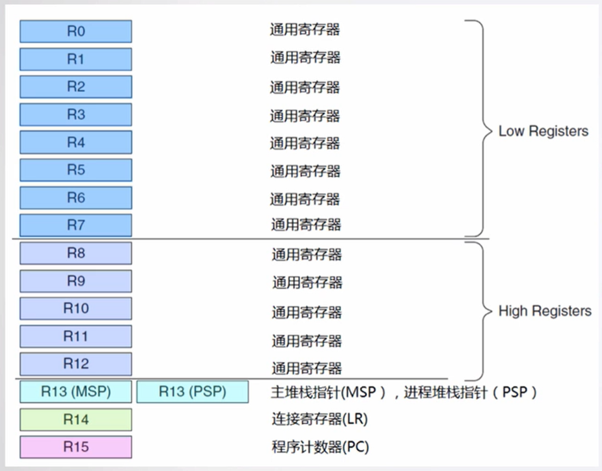

# 芯片内核简介

## 内核概述

Cortex-M3\M4是ARM公司开发的CPU内核。

完整的MCU芯片集成了Cortex-M3\M4内核及其他组件。


特性：

+ 32位RISC处理器；
+ 哈弗结构；
+ 3级流水线；
+ 内嵌中断向量控制器和Systick定时器；

> 注：哈弗结构
>
> （百度百科）哈佛结构是一种将程序指令存储和[数据存储](https://baike.baidu.com/item/数据存储/9827490?fromModule=lemma_inlink)分开的[存储器结构](https://baike.baidu.com/item/存储器结构/15630130?fromModule=lemma_inlink)。哈佛结构是一种并行[体系结构](https://baike.baidu.com/item/体系结构?fromModule=lemma_inlink)，它的主要特点是将程序和数据存储在不同的存储空间中，即[程序存储器](https://baike.baidu.com/item/程序存储器/7661398?fromModule=lemma_inlink)和数据存储器是两个独立的存储器，每个存储器[独立编址](https://baike.baidu.com/item/独立编址/10391400?fromModule=lemma_inlink)、独立访问。
>
> 

## 内核特性介绍

### 1.内核工作模式及权限级别

+ 特权级：不受任何限制，可访问CPU所有资源，执行所有指令；
+ 用户级：受限，部分CPU系统资源不可访问，少量指令无权执行；


### 2.指令集

cortex-M3使用的是Thumb-2指令集。长度可为16位或32位。指令可以携带后缀，如有条件的执行。

示例：

```assembly
CBZ R0, label          ;如果RO为0，则跳转，否则什么都不做
```

#### 指令分类

+ 数据传送指令
+ 数据处理指令
+ 子程序调用及无条件跳转指令
+ 标志位与条件转移指令
+ 饱和运算指令
+ 其他指令

#### 常用指令

存储器访问

```assembly
LDR Rd， =LABEL        ;加载符号LABEL对应的地址，存储到Rd中
LDR Rd, [Rs]           ;从Rs寄存器中取出地址，读取相应的32位/8位数据，存储到Rd寄存器
STR Rd, [Rs]           ;从Rs寄存器中取出地址，将Rd中的32位/8位数据存储到相应的地址处

LDRB Rd， =LABEL
LDRB Rd， [Rs]
STRB Rd, [Rs]
```

批量存储器访问

+ IA（increase after）：在操作完成后递增地址；
+ DB（decrease before）：在操作开始前递减地址；
+ ！：操作结束后，将最终的地址保存到Rd寄存器；

```assembly
LDMIA Rd!, {Rn,...,Rm}     ;从Rd处连续多次递增地址读取32位数据，存储到Rn,...,Rm寄存器列表
STMDB Rd!, {Rn,...,Rm}     ;从Rd处连续多次递减地址存储32位数据，存储到Rn,...,Rm寄存器列表
```

特殊访问指令：

MRS和MSR：用于访问xPSR，PSP，MSP等

```assembly
MRS Rn, <SReg>   ;加载能寄存器的值到Rn
MSR <SReg>, Rn   ;存储Rn的值到能寄存器
```

中断开关：

```assembly
CPSID I    ;关中断
CPSIE I    ;开中断
```

无条件跳转：

```assembly
BX Rn         ;移到寄存器Reg给出的地址，比如BX LR可用于子程序返回
```

比较并跳转指令：

```assembly
CBZ  Rn, <label> ;如果Rn寄存器值为0，则跳转到label对应的指令，否则执行下一条指令
CBNZ Rn, <label> ;如果Rn寄存器值不为0，则跳转到label对应的指令，否则执行下一条指令
```

逻辑或操作

```assembly
ORR Rd, Rn, #imm12        ;Rd = Rn | imm12
```

### 3.内核寄存器组

+ 低组寄存器R0-R7：无需关心
+ 高组寄存器R8-R12：无需关心
+ 链接寄存器LR：存储子程序调用的返回地址
+ 程序计数器PC：记录程序运行到的地址
+ 堆栈指针寄存器R13：MSP和PSP



> 双堆栈寄存器R13（基于特权级）
>
> 

+ 程序状态寄存器

    + ALU运算标志
    + 工作模式，Thumb模式，必须为1
    + 当前异常序号

    

+ 异常屏蔽寄存器


### 4.异常\中断处理

+ 系统异常列表


+ 外部中断列表


#### 进入异常

	1. 硬件将xPSR、PC、LR、R12和R0-R3自动压入当前堆栈，其他寄存器根据需要由ISR自动保存；


 2. 从中断向量表获取入口地址；

    + SP：入栈后保存最后的堆栈地址；
    + PC：更新为终端服务入口地址；
    + LR：更新为特殊的EXC_RETURN的值；

    

	3. 执行异常\中断处理程序；

#### 退出异常

1. 执行返回指令，如BX LR；
2. 回复先前入栈的寄存器。出栈顺序与入栈时相对应，堆栈指针的值也改回去；
3. 从原中断发生的位置继续往下运行；

> 注：在返回时，会根据EXC_RETURN值来决定返回动作。
>
> 
>
> 合法的EXC_RETURN值
>
> 

#### 复位异常响应序列


#### PendSV异常

在PendSV中执行RTOS上下文切换（即不同任务间切换）。

工作原理：配置位最低优先级，上下文切换的请求将自动延迟到其他的ISR都处理完成后，并且可被其它异常\中断抢占。


### 5.堆栈

cortex-M3使用的是“向下生长的满栈”模型，采用双堆栈机制。

+ 压栈操作


+ 出栈操作


### 6.存储映射

cortex-M3预定义的存储器映射

