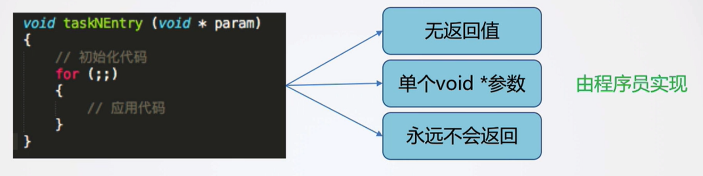
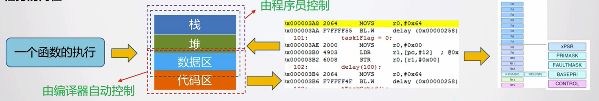
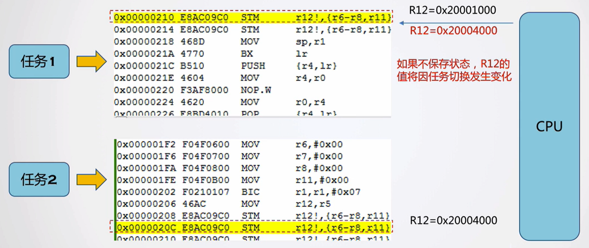
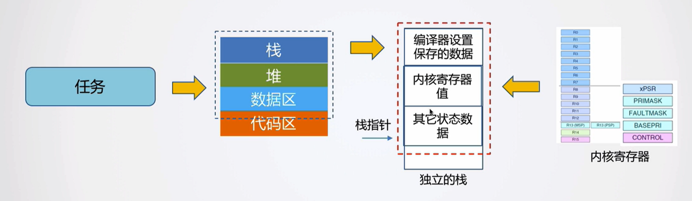

# 任务定义与切换原理

## 任务是什么

任务的外观：一个永远不会返回的函数。



任务的内在：



## 任务切换原理

### 1.任务切换的本质

保存前一个任务的当前运行状态，恢复后一个任务之前的运行状态。



### 2.任务状态数据

+ 代码、数据区：由编译器自动分配，各个任务相互独立，并不冲突；
+ 堆：不使用；
+ 栈：硬件只支撑两个堆栈空间（用户级和特权级），**不同任务能否共用？不能**
+ 内核寄存器：编译器会在某些时间将值保存到栈中，如函数调用、异常处理；**未保存的如何处理？也需要手动进行保存**
+ 其他状态数据如何处理？

### 3.解决方法

为每个任务配置独立的栈，用于保存该任务的所有状态数据；



## 设计实现

### 1.定义堆栈类型

```C
/* cortex-M的堆栈单元类型：堆栈单元的大小为32位，所以使用uint32_t */
typedef uint32_t tTaskStack;
```

### 2.定义任务类型

```c
/* 任务结构：包含了一个任务所有的信息*/
typedef struct _tTask {
    /* 任务所用堆栈的当前堆栈指针。每个任务都有他自己的堆栈，用于在运行过程中存储临时变量等一些环境参数。
    在tinyOS运行该任务前，会从stack指向的位置处，会读取堆栈中的环境参数恢复到CPU寄存器中，然后开始运行。
    在切换至其他任务时，会将当前CPU寄存器值保存到堆栈中，等待下一次运行该任务时再恢复。
    stack保存了最后保存环境参数的地址位移，用于后续恢复。 */
    uint32_t *stack;
}tTask;
```

### 3. 声明两个任务

```C
/* 任务1和任务2的任务结构，以及用于堆栈空间 */
tTask tTask1;
tTask tTask2;
tTaskStack task1Env[1024];
tTaskStack task2Env[1024];
```

